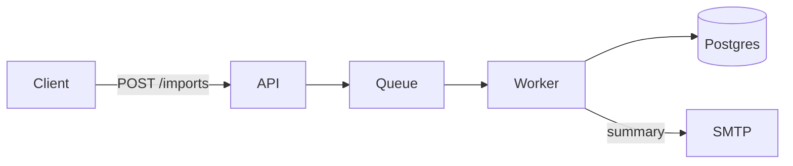

# Visualise before building

After the spec is written and stressed, and **before anyone accepts it or
writes a line of code**, the design gets drawn.

## Why this sits before the gate, not after

The obvious place for a diagram is documentation - draw the system once it
exists, so newcomers can find their way. That is a real use and it is not this
one.

Here the diagram is a **review instrument**. A reviewer reading twelve sections
of prose is holding the whole architecture in working memory and checking it
against itself; almost nobody does that well, which is why specs get approved
with a circular dependency or a boundary in the wrong place still in them. The
same reviewer looking at a picture finds those in seconds, because a wrong
shape *looks* wrong.

So the order is: write the spec, stress it, **draw it**, then put both in front
of a human. Drawing it after acceptance means the diagram documents a decision
nobody could see when they made it.

The second reason is cheaper to state: **a design you cannot draw is not
finished.** If the boxes will not resolve - if a component keeps needing an
arrow to everything, if a boundary cannot be placed without cutting an entity
in half - that is the spec telling you something before the compiler does.

## Route to `archify`

`archify` visualises the spec, the system design and the architecture. Run it
on the accepted-pending spec, and put its output in the review packet
alongside the document.

Check availability first, the same as every other skill this repo names
(`skill-map.md`). **Never claim a diagram was produced by a skill that is not
installed.**

**If `archify` is not available**, draw it by hand rather than skipping it -
the diagram is doing review work, so its absence costs more than its
roughness. Mermaid in a fenced block is enough, renders on GitHub, and lives in
version control as text:

````markdown

````

Keep to the families in `explain-diff-html`'s `diagrams.md` if that skill is
installed - the reasoning about reused visual grammar applies here too.

## What to draw

Three views cover most specs. Draw the ones the spec actually decided; an empty
diagram of a thing nobody designed is worse than none.

| View | Shows | Reveals |
|---|---|---|
| **Components and flow** | the boxes, and what calls what, with example data on the arrows | a component talking to everything; a missing boundary |
| **Data and ownership** | entities, who owns which, lifetimes | two owners for one row; an entity with no lifetime |
| **The seams** | the interfaces from spec section 7, drawn as boundaries | a seam in the wrong place, which is the expensive one to move later |

Mark on the drawing what the **first slice** covers. A slice that turns out to
touch every box is not a slice, and this is where that becomes visible rather
than three weeks in.

## Reading it against the spec

The diagram is not decoration next to the document; the two are checked against
each other, and disagreements are findings:

- **A box with no owner** in the data model → section 6 is incomplete.
- **An arrow with no failure behaviour** in section 8 → the most common gap in
  any spec, now visible as a line nobody has said what happens to.
- **A cycle** → either a real design problem or a missing abstraction; both are
  worth knowing before building.
- **Something in the drawing that is in no decision record** → it was assumed,
  not decided. Back to `spec-format.md`.

Where the drawing and the prose disagree, **the prose is not automatically
right.** Often the diagram is what the author actually meant, and the section
is what they managed to write.

## Where it goes

`docs/architecture/` - which is where groundwork's bootstrap looks for concern
2, so a diagram there resolves that row to a pointer the same way the spec
resolves concerns 1 and 11. Reference it from the spec so the two travel
together.

Keep it as text (Mermaid, or whatever `archify` emits that survives in git). A
binary export in a `docs/` folder is stale the first time the design moves and
nobody can tell, because a diff on a PNG says nothing.
